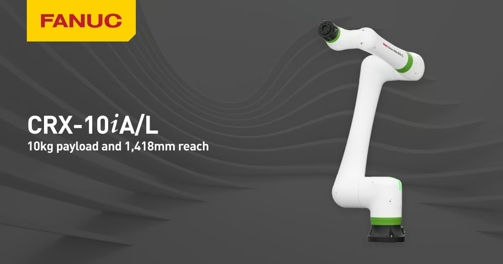
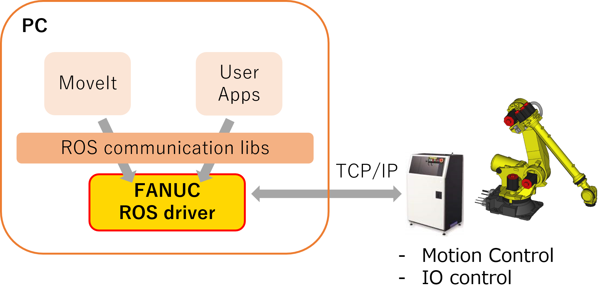
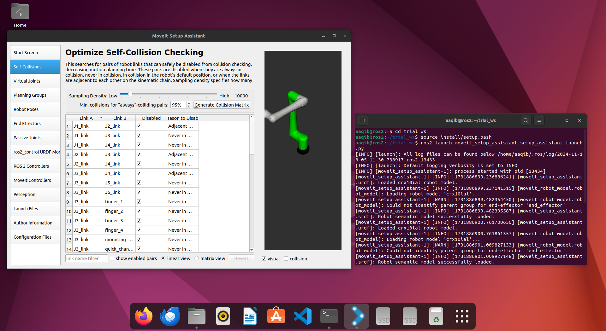
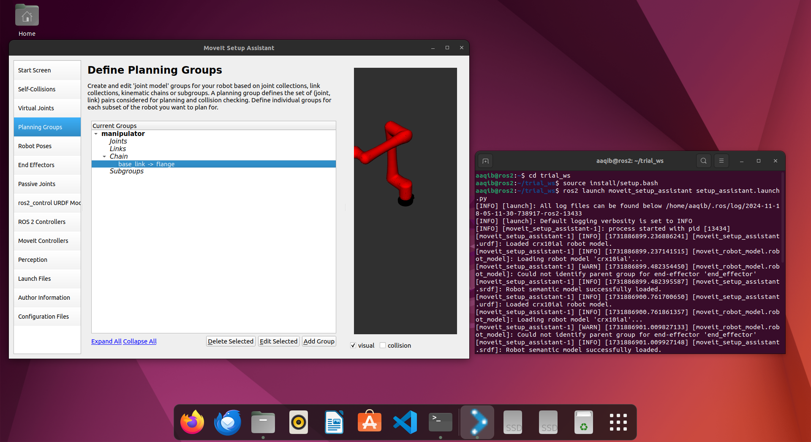
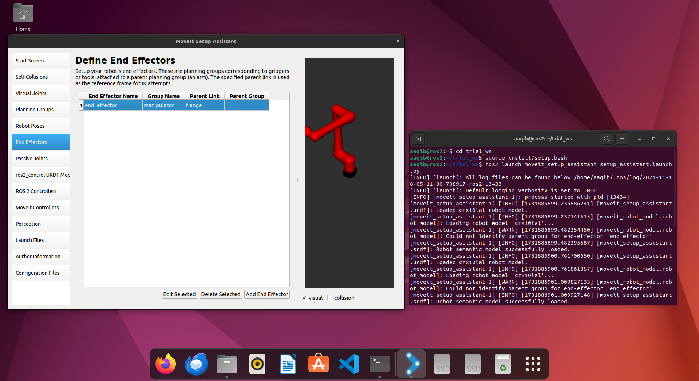
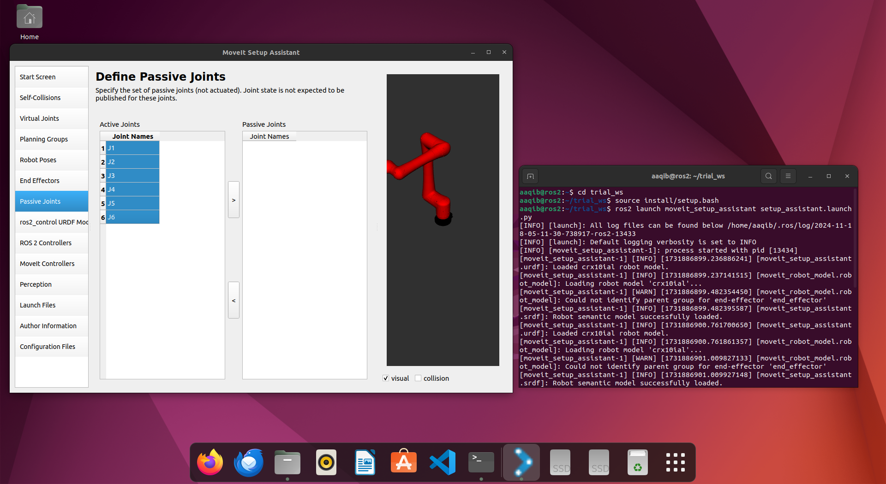
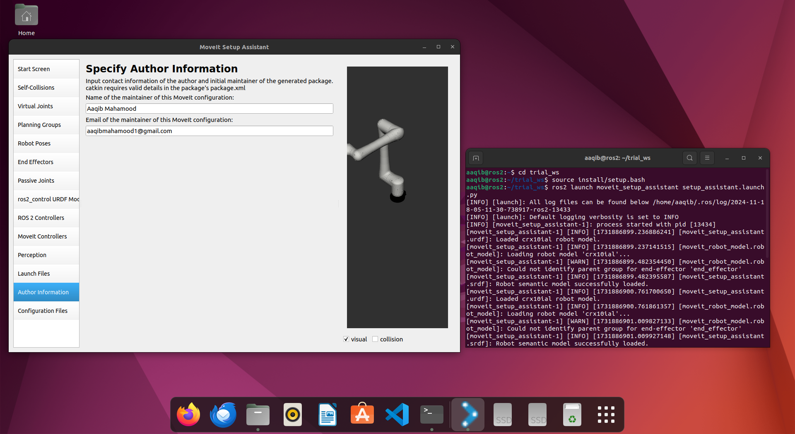
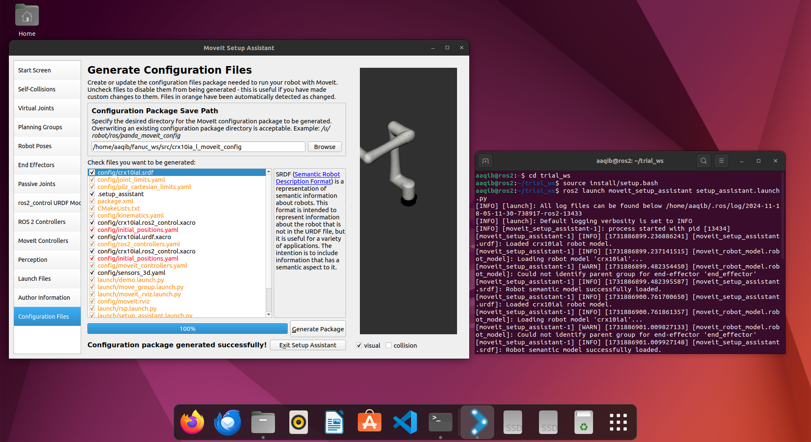
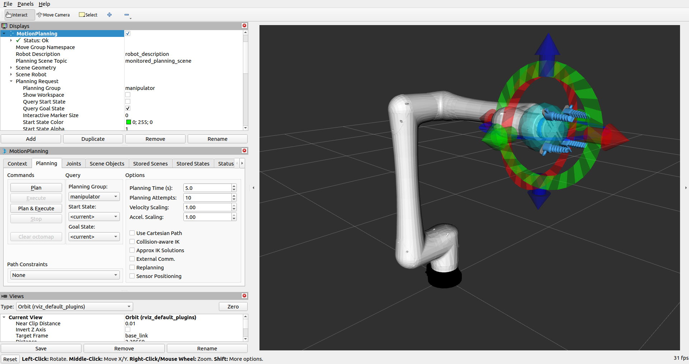
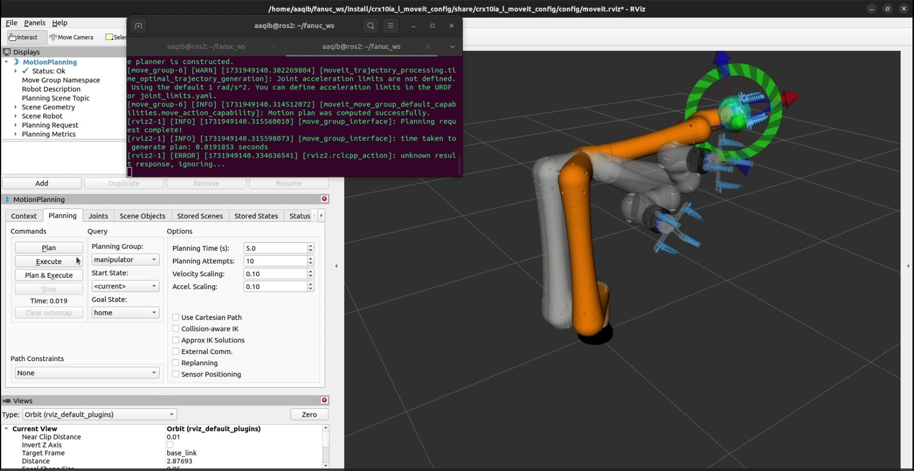

# Simulate Fanuc CRX10ia/L using ROS2 Humble and MoveIt2

<p align="center">
    
    
    
</p>

## Clone and Launch Simulation

### If you wish to clone and launch the simulation, follow these steps:

1. **Create a workspace**
```bash
mkdir -p ~/fanuc_ws/src
cd ~/fanuc_ws/src
```

2. **Clone the repository**
```bash
git clone https://github.com/jeremynguyenn/Fanuc-CRX10ia-L-using-ROS2-Humble-and-MoveIt2.git
```

3. **Build the workspace**
```bash
cd ~/fanuc_ws
colcon build
```

4. **Source the workspace**
```bash
source install/setup.bash
```

5. **Launch the simulation - Start Move Group**
```bash
ros2 launch crx10ia_l__moveit_config move_group.launch.py
```

6. **In a new terminal, launch RViz**
```bash
source ~/fanuc_ws/install/setup.bash
ros2 launch crx10ia_l__moveit_config moveit_rviz.launch.py
```

7. **In another terminal, run the trajectory**
```bash
source ~/fanuc_ws/install/setup.bash
ros2 launch moveit2_scripts test_trajectory.launch.py
```

## FANUC ROS2 Driver Installation





### Prerequisites
Before proceeding with the installation, ensure your system meets the following requirements:

1. **Update System Packages**
```bash
sudo apt update && sudo apt upgrade -y
```

2. **Install ROS2 Humble Packages**
```bash
sudo apt install -y \
ros-humble-desktop \
ros-humble-rviz \
ros-humble-control-msgs \
ros-humble-sensor-msgs
```

3. **Source ROS2 Setup**
```bash
source /opt/ros/humble/setup.bash
```

4. **Install Dependencies**
```bash
sudo apt install libmodbus-dev libjsoncpp-dev
```

### Install FANUC ROS2 Driver
1. **Extract Driver Files**
   - Unzip the installation file (install_humble_jammy.zip) to your Ubuntu PC
   - ⚠️ **CAUTION:** Do not place in your colcon workspace

2. **Set Required Permissions**
```bash
chmod u+x {driver_location}/fanuc_ros2_driver/lib/f
chmod u+x {driver_location}/_local_setup_util_sh.py
```

3. **Add to ROS Path**
   
   If using packages only under /opt/ros/* without colcon workspace:
```bash
source install/local_setup.bash
```
## Table of Contents
- [0. Quick Start](#0-quick-start)
- [1. ROS Setup](#1-ros-setup)
- [2. Dependencies](#2-dependencies)
- [3. Workspace Configuration](#3-workspace-configuration)
- [4. MoveIt2 Configuration](#4-moveit2-configuration)
- [5. Trajectory Planning](#5-trajectory-planning)
- [6. Simulation](#6-simulation)

## <span id="0">0. Quick Start

*Tested on Ubuntu 22.04 LTS with ROS2 Humble.*

1. **Update System**
```bash
sudo apt update && sudo apt upgrade -y
```

2. **Install ROS2 Humble Packages**
```bash
sudo apt install -y \
ros-humble-desktop \
ros-humble-rviz \
ros-humble-control-msgs \
ros-humble-sensor-msgs
```

3. **Source ROS2 Setup**
```bash
source /opt/ros/humble/setup.bash
```

## <span id="1">1. ROS Setup

### Install Core Dependencies
```bash
sudo apt install libmodbus-dev libjsoncpp-dev
```

### Install MoveIt2
```bash
sudo apt update
sudo apt install -y ros-humble-moveit ros-humble-moveit-resources
sudo apt install -y python3-colcon-common-extensions build-essential
```

## <span id="2">2. Workspace Preparation

### Create Workspace
```bash
mkdir -p ~/fanuc_ws/src
cd ~/fanuc_ws
colcon build
```

### Add CRX Description Files
```bash
# Option 1: Copy local files
cp -r /path/to/crx_description ~/fanuc_ws/src/

# Option 2: Clone Repository
git clone https://github.com/jeremynguyenn/Fanuc-CRX10ia-L-using-ROS2-Humble-and-MoveIt2.git
cd fanuc_ws
cd src
cd crx_description
```

## <span id="3">3. MoveIt2 Configuration

### Launch MoveIt Setup Assistant
```bash
source /opt/ros/humble/setup.bash
ros2 launch moveit_setup_assistant setup_assistant.launch.py
```

### Configuration Steps
1. **Load URDF**
- Browse and select `crx10ia_l.urdf.xacro`

2. **Self-Collision Matrix**
- Generate Collision Matrix


3. **Virtual Joints**
- Create Joint:
- Name: `world_base`
- Parent Frame: `world`
- Child Link: `base_link`
- Type: `fixed`


4. **Planning Groups**
- Group Name: `manipulator`
- Kinematics Plugin: KDLKinematicsPlugin
- Base Link: `base_link`
- Tip Link: `flange`


5. **Robot Poses**
- Add `home` pose for `manipulator` group

### MoveIt2 Configuration -  Home Robot Pose

6. **End Effector**
- Name: `end_effector`
- Group: `manipulator`
- Parent Link: `flange`


7. **Define Passive Joints**  
 

8. **Generate and Save the MoveIt Package**    
 
 

## <span id="4">4. Trajectory Planning Package

### Create MoveIt2 Scripts Package
```bash
cd ~/fanuc_ws/src
ros2 pkg create moveit2_scripts --build-type ament_cmake \
--dependencies rclcpp moveit_ros_planning_interface
```

### Create Trajectory Script
`src/test_trajectory.cpp`:
```cpp
#include <rclcpp/rclcpp.hpp>
#include <moveit/move_group_interface/move_group_interface.h>

int main(int argc, char** argv) {
    rclcpp::init(argc, argv);
    auto node = rclcpp::Node::make_shared("test_trajectory");
    
    moveit::planning_interface::MoveGroupInterface move_group(node, "manipulator");

    // Plan to a target pose
    geometry_msgs::msg::Pose target_pose;
    target_pose.orientation.w = 1.0;
    target_pose.position.x = 0.28;
    target_pose.position.y = -0.2;
    target_pose.position.z = 0.5;

    move_group.setPoseTarget(target_pose);
    
    auto success = (move_group.plan() == moveit::planning_interface::MoveItErrorCode::SUCCESS);
    
    if (success) {
        RCLCPP_INFO(node->get_logger(), "Planning successful. Executing...");
        move_group.move();
    } else {
        RCLCPP_WARN(node->get_logger(), "Planning failed.");
    }

    rclcpp::shutdown();
    return 0;
}
```

### Launch File
`launch/test_trajectory.launch.py`:
```python
from launch import LaunchDescription
from launch_ros.actions import Node

def generate_launch_description():
    return LaunchDescription([
        Node(
            package='moveit2_scripts',
            executable='test_trajectory',
            output='screen',
        )
    ])
```

## <span id="5">5. Build and Run

### Build Workspace
```bash
cd ~/fanuc_ws
colcon build --symlink-install
source install/setup.bash
```

### Run Simulation
1. Start Move Group - Terminal 1
```bash
ros2 launch crx10ia_l__moveit_config move_group.launch.py
```

2. Launch RViz - Terminal 2
```bash
source ~/fanuc_ws/install/setup.bash
ros2 launch crx10ia_l__moveit_config moveit_rviz.launch.py
```
 

Plan a trajectory to the **home** position.

 


3. Execute Trajectory - Terminal 3 
```bash
source ~/fanuc_ws/install/setup.bash
ros2 launch moveit2_scripts test_trajectory.launch.py
```

## <span id="6">6. Video Demonstrations

### Trajectory Execution

## Troubleshooting
- Ensure ROS2 Humble is correctly installed
- Verify all dependencies are met
- Check URDF and MoveIt configuration files
